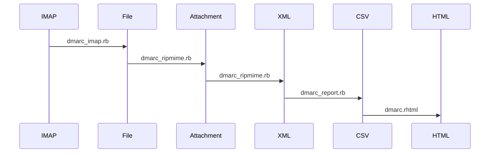

# dmarc_report
This is the backend for parsing DMARC reports

Backend and frontend should run on diffrent machines.
This avoids to have you IMAP credentials on the public webserver.
The cron-job push the results via rsync to the webserver.

## Requirements:
 * Install cron
 * Install ruby
 * Install ruby-rubygems
 * Install ripmime
 * Install gzip (gunzip)
 * Install unzip
 * Install rsync
 * IMAP Account where DMARC reports are comming in
 * Configuration in YAML

## Installation:

    gem install --user-install dmarc_report

for Diagnostics, add the rubygem dir to your search path

FreeBSD:

    vim .profile
    PATH="$PATH:$HOME/.gem/ruby/3.1/bin"

Debian:

    vim .profile
    PATH="$PATH:$HOME/.local/share/gem/ruby/3.1.0/bin"

Create the working directory:

    cd
    mkdir -p dmarc
    cd dmarc
    install-dmarc_report.rb

Edit your IMAP account data:

    vim config/dmarc.yml

Check your rulesets:

    vim rules/dmarc.yml

Edit the target directory for your webserver:

    vim dmarc_profile.sh

Check the script for your cron:

    vim run-dmarc.sh

Check the function

    ./run-dmarc.sh

Edit your crontab:

    crontab -e
    # crontab for dmarc_report
    #minute hour    mday    month   wday    command
    13      8,12,18 *       *       *       /home/user/dmarc/run-dmarc.sh
    #

# Processing:

# Frontend:

See: https://github.com/dinoex/dmarc_view

